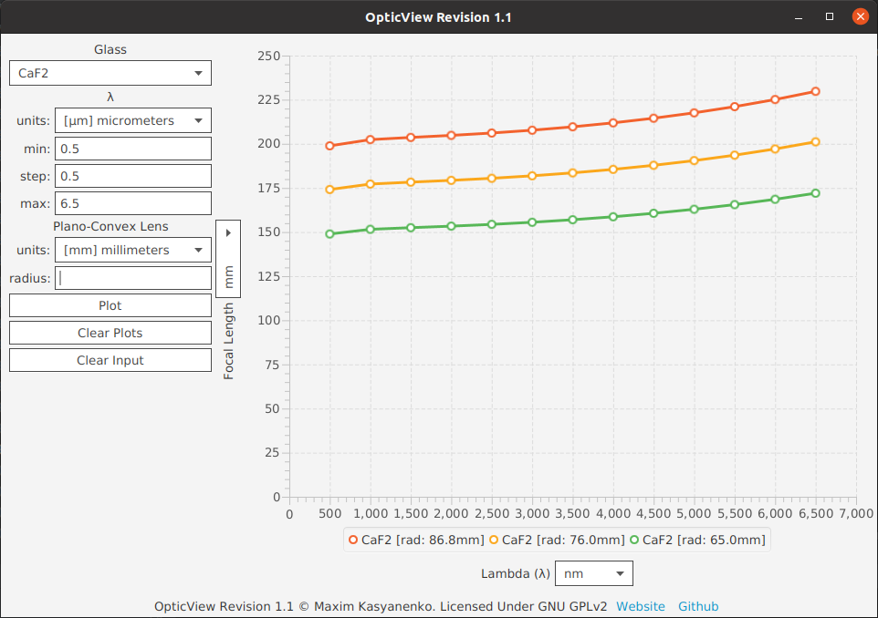

# OpticView

A utility program to graph the changes in focal
length of different material lenses with respect
to wavelength.

## Revision 1 (r1.0)

The first revision of the program took a long time
to get to due to several design issues with the
first couple of prototypes, mainly in-house, custom
built graphing components which are themselves
a mighty project on their own. After several design
iterations, I opted to use JavaFX's built-in
`XYChart` for the time being. However, this component
lacks a considerable feature set (ex. continuous
function support, multi-precision decimal computation,
specialized numerical plotting schemes, etc.) which
considerably hinders development time, quality, and
user experience.

### Addition Log

- User input of glass material, lambda interval, and
a single lens radius.
- Ability to graph aforementioned parameters and to
subsequently clear both the graph and input form.
- `DoubleField` for specialized double precision
decimal input.

### Future Amendments

- Spawn a sister project dedicated to providing high
performance, feature rich scientific graphing
tools and components in JavaFX to speed up development
time, quality, and ultimately improve user experience.

## Revision 1.1 Update 1 (r1.1u1)

Revision 1.1 introduces flexible data representation
by allowing the user to decide which units their input
shall be in, and which units the graph should be
displayed with, alongside minor improvements to other
aspects of UX.

### Addition Log

- Dynamic scientific unit scopes.
- Plot sample tooltip displaying more information about
a particular plot.
- Provisional application icon.
- Input form improvements.
- Various plot bug fixes.

### Future Amendments

- Proceed the development of a specialized, high performance
graphing library.

### Gallery

